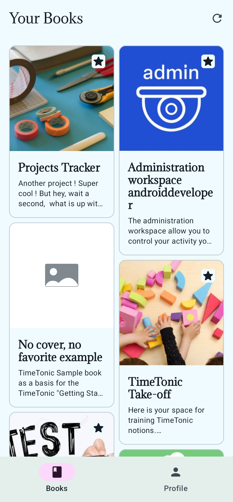

# 📐 Timetonic API Technical Assessment
Simple Android application that authenticates and fetches books from the [Timetonic](https://timetonic.com/) Public API

## 💽 Demo
Check out a demo video here: https://youtu.be/Fpo8hWGLadE\
You can also download the APK from the releases page

## 📸 Screenshots
|                          |                        |                              |
| ------------------------ | ---------------------- | ---------------------------- |
|  |  |  |

## 🔩 Tech Stack
Built using the latest and recommended Android tecnologies

- Android
- Kotlin
- Coroutines
- Jetpack Compose
- Compose Material
- Jetpack Navigation
- Jetpack Hilt
- Jetpack DataStore
- OkHttp
- Coil